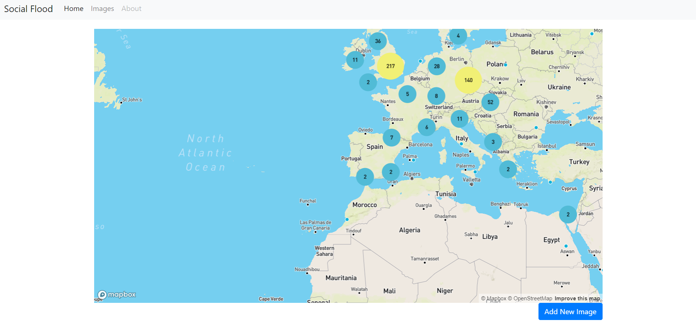

# Social Flood

Repository that contains the code for a server that uses [mapbox](https://www.mapbox.com/) to display, in a global map, 
all the geo-referenced images used in my MSc thesis experiments. Within this website, it is also possible to test the 
considered model with your own examples! You can download the weights of the model [here](https://drive.google.com/open?id=1rEMXj6tbNQLKAwR7GXh7cjJIRc-vo_rQ).
After having downloaded the file place it under the folder `SocialFlood/static/keras`.

### How to use

The code was developed and tested in [Python](https://www.python.org/) 3.6.7 with [Django](https://www.djangoproject.com/) 2.2.1, and [Keras](https://keras.io/) 2.2.4 using [Tensorflow](https://www.tensorflow.org/) 1.13.2 as backend.
To run the server, simply execute:

```console
$ python3 manage.py runserver
```

If you are running the server for the first time, do not forget to initialize the database using the following commands.

```console
$ python3 manage.py makemigrations
$ python3 manage.py migrate
```

If you want to start the server using the images that I considered in my work, you have to download the files from [here](https://drive.google.com/drive/folders/1VEpp3OSyG7naXkFnWDRBksZuPkoD5DCQ),
and place them under the folder `media/images/` on the root directory of the project. To create the instances on the database, 
execute the following command:

```console
$ python3 manage.py init_db
```

It may take a while to start the server, since the Keras model is being loaded to memory.
When the server starts running, to access the main page, please go to `http://127.0.0.1:8000/maps/`, your page should look similar to the one below.


